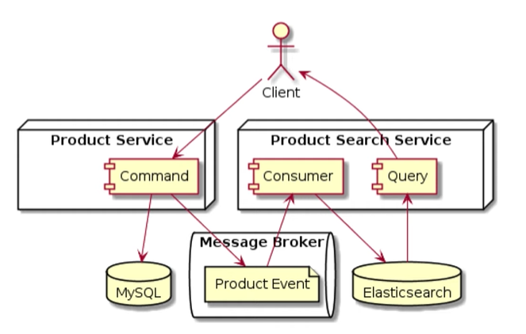

### CQRS Example In Go

This is a simple example of CQRS in Go, inspired by [Belajar Microservices - 15 CQRS (Command Query Responsibility Segregation)](https://www.youtube.com/watch?v=eei78T5Nz-U) by [Programmer Zaman Now](https://www.youtube.com/@ProgrammerZamanNow).

Here's the architecture diagram:  
